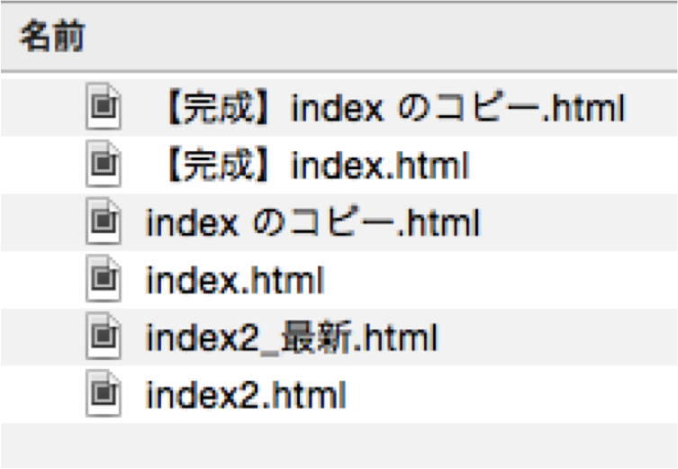

# Git入門その1
Gitによるバージョン管理について学習します。

## 1. バージョン管理とは
「バージョン管理」 = 「ファイルの変更履歴の管理」

「いつ」「だれが」「どのファイルを」「どう編集したか」が分かるということ



どれが最新なんだ...
ちょっと前の状態が良かったんだけど、戻れないよ...

## 1.1. Gitのインストールと設定
- Git = 世界のみんなが使っているバージョン管理システム
- インストールは既に完了している(初日にやりました)
- いくつか設定があるのでやっておく

```bash:gitのインストール
$ git
$ git --version
$ git config --global user.name "Kashiwagi"
$ git config --global user.email "kashiwagi@example.com"
$ git config --global color.ui true
```


## 1.2. Gitの概念と基本用語
基本の用語
- リポジトリ
    - ローカルリポジトリ
    - リモートリポジトリ(Gitリポジトリ)
        - ワーキングツリー
        - ステージングエリア

[SlieShareリンク](http://www.slideshare.net/secret/IjhyNPJW7Nla55)

## 2. Gitをつかってみよう
とりあえず使ってみましょう

## 2.1. Gitの初期化

```bash:Gitの初期化
$ mkdir git_test
$ cd git_test
$ git init
$ ls -la
```

- `git init`を実行したディレクトリの直下に`.git`ディレクトリを作成する
- .gitディレクトリ に現在のディレクトリ以下を管理するリポジトリデータが格納される
- このディレクトリ以下を、このリポジトリに付随した"ワーキングツリー"と呼ぶ
- ワーキングツリーでファイル編集などを行い、リポジトリに登録して、ファイルの変更履歴を管理する
- なので、(履歴が記録されていれば)リポジトリから過去のファイルを取り出して、ワーキングツリーに展開できる(≒好きな状態に戻れる)
- RPGのセーブポイントみたいなもの


## 2.2. Gitの状態を知る
Gitリポジトリがどうなっているかを把握するのは重要！
(あるファイルはワーキングツリーなのか、それともステージングなのか？)

```bash:リポジトリの状態を確認
[vagrant@localhost git_test]$ git status
# On branch master
#
# Initial commit
#
nothing to commit (create/copy files and use "git add" to track)
```

## 2.3. はじめてのコミット
コミットしてみよう！
[ポイント]
- コミットするには対象ファイルステージングエリアにないといけない
- つまり、commitする前にはaddしないといけない

まずはファイルを作って編集


```bash:はじめてのcommit
$ vi README.md
```

```md:README.md
# git_test
```

この時点で `git status`


```bash:
[vagrant@localhost git_test]$ git status
# On branch master
#
# Initial commit
#
# Untracked files:
#   (use "git add <file>..." to include in what will be committed)
#
#   README.md
nothing added to commit but untracked files present (use "git add" to track)
```

README.md を `add` しましょう！
`add` したら `git status` で状態を確認

```bash:add
$ git add README.md
$ git status

# On branch master
#
# Initial commit
#
# Changes to be committed:
#   (use "git rm --cached <file>..." to unstage)
#
#   new file:   README.md
#
```

無事、README.mdがステージングエリアにいったので、コミットしましょう！
コミットしたら`git status`で状態チェック！

```bash:commit
$ git commit

# Please enter the commit message for your changes. Lines starting
# with '#' will be ignored, and an empty message aborts the commit.
#
# Committer: vagrant <vagrant@localhost.localdomain>
#
# On branch master
#
# Initial commit
#
# Changes to be committed:
#   (use "git rm --cached <file>..." to unstage)
#
#       new file:   README.md
#

$ git stauts
# On branch master
nothing to commit (working directory clean)
```


## 2.4. 変更履歴を確認しよう
- 変更の履歴(≒コミットの履歴)を確認しましょう

```bash:log
$ git log
commit e913132af40b3e14e55bf93c05cd9339e7f67508
Author: vagrant <vagrant@localhost.localdomain>
Date:   Wed Feb 17 17:53:36 2016 +0900

    First commit
```

[ログの見方]
commit: コミットのID。それぞれ固有の値が割り振られる。コミットIDに重複がないので、コミットID指定により、特定のコミットまで戻れるという寸法。


## 2.5. 練習問題

```txt:練習問題
/var/www/html/git_practice というディレクトリを作成し、gitの設定をしてください。
また、同ディレクトリにて、次のような「test.txt」というファイルを作成し、コミットしてください。
なお、コミットメッセージは、「test commit」とすること。
```

以下、解答例(まずは自分でやってね！)


```bash:練習問題の解答例
$ cd ..
$ mkdir git_practice
$ cd git_practice
$ git init
$ vi test.txt
$ git add test.txt
$ git commit -m "test commit"

$ git log
$ git log test.txt
$ git log -p
```


## 3. 変更の差分を見る
`git log -p` でコミットによる変更内容を見れたけど、コミットする前に変更内容を確認できないか？

まずは、ファイル編集

```bash:
$ vi README.md
```

```md:README.md
# git_test

line3
```

## 3.1. ワーキングツリーとステージングエリアの差分
現在のワーキングツリーとステージングエリアの差分を確認
まだ add していないので、ワーキングツリーとステージングエリアにあるファイルには差分があるよね？

```bash:diff
$ git diff
```

じゃあ、addしてみよう

```bash:
$ git add .
$ git diff
```

今度は、addしたことによって、ワーキングツリーとステージングに差がないので git diff しても何も表示されない


## 3.2. ステージングエリアと最新コミットの差分

```bash:
$ git status ### README.mdがステージングエリアであることを書くに院
$ git diff HEAD
```

`HEAD` = 「最新のコミットの別名」
- いちいちコミットIDで示すのは面倒だし、よく使うので最新コミット用の名前があると便利ということ
- ちゃんと説明すると`HEAD`は、「作業しているブランチの最新コミットを参照するポインタ」


じゃあ、コミットします

```bash:
$ git commit -m "Add line3"
$ git log
```

## 3.3. ところでコミットメッセージの書き方


## 4. 歴史の変更を行う
「Gitは過去の状態に戻せるよ！」とか「すぐやり直しができるよ！」というのを体感。
ここらへんのコマンドは暗記するのではなくて、問題が起きてからググればOK。
なので、今は「へ〜そういうのがあるんだ〜」で問題なし！

## 4.1. 歴史の変更その1_直前のコミットを変更その1
「やっべえ！ コミットメッセージ間違えたあああああ！！！」という時の対処法

まずはファイル編集

```bash:
$ vi README.md
```

```md:README.md
# git_test

line3

line5
```

コミットメッセージを間違えてみる

```bash:
$ git add README.md
$ git commit -m "Add line55555"
$ git commit --amend
```


## 4.2. 歴史の変更その1_直前のコミットを変更その2
「コミットし忘れたファイルがあった....」という時の対処法

まずはファイル編集

```bash:
$ vi README.md
$ vi index.php
```

```php:index.php
<?php echo "hello";
```

```md:README.md
# git_test

line3

line5

line7
```

`README.md` と `index.php` どちらもコミットするつもりが、
`README.md` を `add` し忘れる

```bash:
$ git status
$ git add index.php
$ git commit -m "Add line7 & Create index"
$ git status
```

もういちど add→commit でもいいが、ひとつにまとめたほうがすっきりする(ログが汚れない)。
こういうときも --amend でいける

```bash:
$ git add README.md
$ git commit --amend
Add line7 & Create index

# Please enter the commit message for your changes. Lines starting
# with '#' will be ignored, and an empty message aborts the commit.
# On branch master
# Changes to be committed:
#   (use "git reset HEAD^1 <file>..." to unstage)
#
#       modified:   README.md
#       new file:   index.php
#
`
```

`add` のし忘れを防ぐために `git add . ` を使うと良い


## 4.3. 歴史の変更その2_ステージしたファイルの取り消し
今度は「1ファイルずつコミットするつもりが、一気にaddしてさあ大変」という時の対処法


まずは2ファイル編集

```bash:
$ vi README.md
$ vi index.php
```

```md:README.md
# git_test

line3

line5

line7

line9
```

```php:index.php
<?php echo "hello world";
```


別々に`add`するつもりが、ついクセで `git add . ` しちゃった。

```bash:
$ git add .
$ git status
# On branch master
# Changes to be committed:
#   (use "git reset HEAD <file>..." to unstage)
#
#   modified:   README.md
#   modified:   index.php
#
````

どうやって、`add`を取り消せばいいんだ？
答えは書いてある

```bash:
$ git reset HEAD index.php
Unstaged changes after reset:
M   index.php
$ git status
```

というわけで別々にコミットしましょう

```bash:
$ git commit -m "Add line9"
$ git add .
$ git commit -m "hello world"
```

## 5. コマンドまとめ

### `git --version`
インストールされているGitのバージョンが分かるコマンド

### `git config --global ◯◯.☆☆ △△`
Gitの設定変更ができるコマンド
とりあえず、
`user.name` `user.email` `color.ui` を設定しておけばOK


### `git init`
Gitの初期化コマンド
こいつがいないと始まらない
このコマンドを実行したディレクトリの直下に`.git`ディレクトリを作成する
- .gitディレクトリ に現在のディレクトリ以下を管理するリポジトリデータが格納される
- このディレクトリ以下を、このリポジトリに付随した"ワーキングツリー"と呼ぶ
- ワーキングツリーでファイル編集などを行い、リポジトリに登録して、ファイルの変更履歴を管理する
- なので、(履歴が記録されていれば)リポジトリから過去のファイルを取り出して、ワーキングツリーに展開できる(≒好きな状態に戻れる)
- RPGのセーブポイントのイメージに近い

### `git status`
リポジトリの状態を確認できる
- どのファイルがどの状態なのかを知るために良く使うコマンド
- 細かいことはあとで説明します
- 「歴史を記録する」 = "commit" であり、まだ何も記録していないので nothing to commit

### `git add <filepath>`
対象したファイルをステージングエリアに上げるコマンド
対象ファイルの指定は
- 1. ファイル名を入力
- 2. 「.」を使うと現在のディレクトリ(カレントディレクトリ)のファイルを全てaddしてくれる

### `git commit`
ステージングエリアにあるファイルをコミット(変更履歴を登録)するコマンド
`-m` のオプションを使うとコミットメッセージがサッと入れられる

### `git log`
Gitのコミットログを確認するコマンド
`-p` のオプションを使うと変更内容を表示する
`--graph` のオプションを使うと視覚的に分かりやすく表示してくれる


